# Lab 01 Report - Introduction to Open Source Software

## 0. Join the Discord if you haven't already

Discord message:

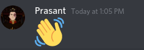

## 1. Create and setup a Github account

[Github handle](https://github.com/Prasantacharya)

## 2. Reading assignments

* Open Source Definition

  1. a

* Smart Questions

* Free Culture

* Beautiful Code

## 3. Linux

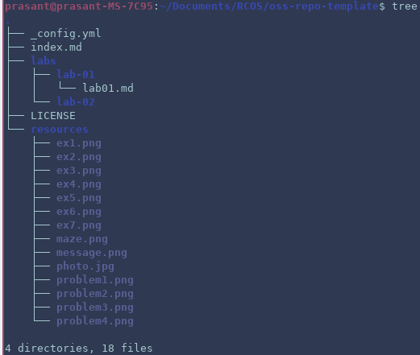

## 4. Regex

**Regex problems:**

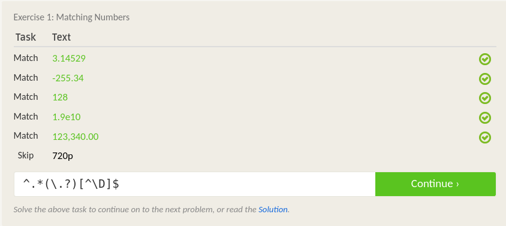

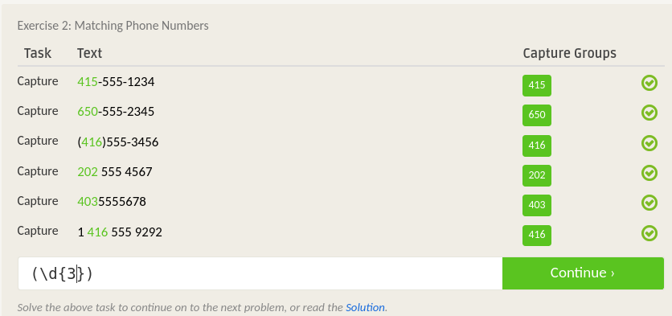

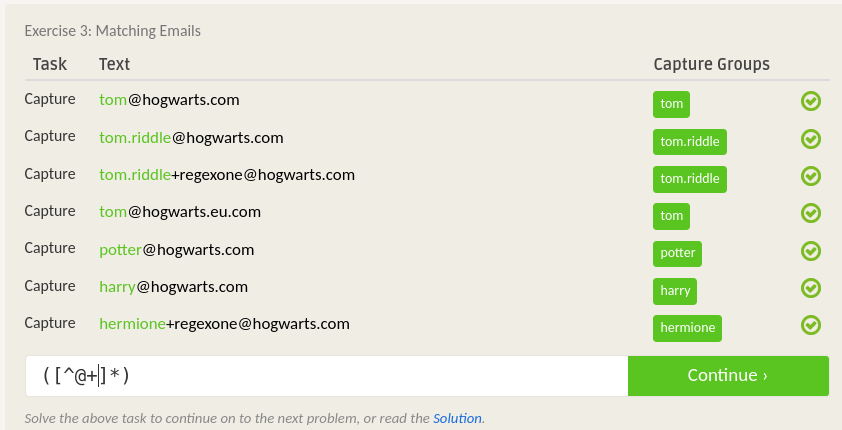

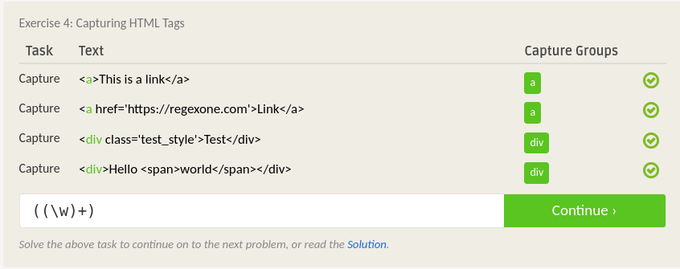

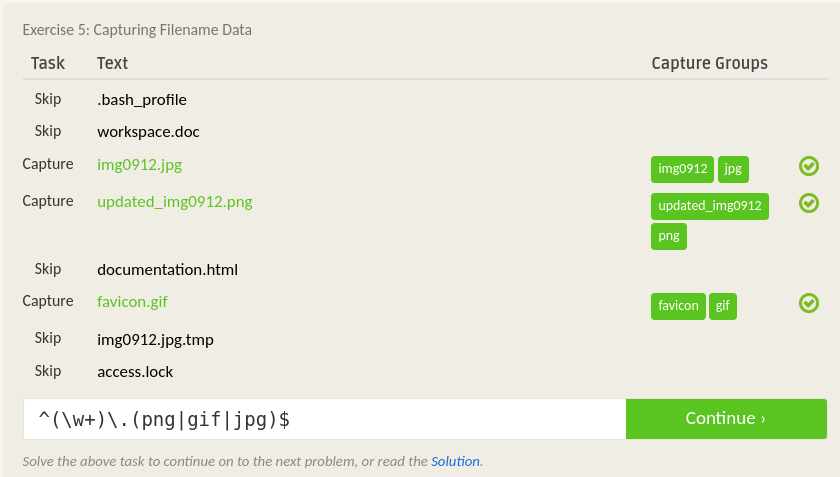

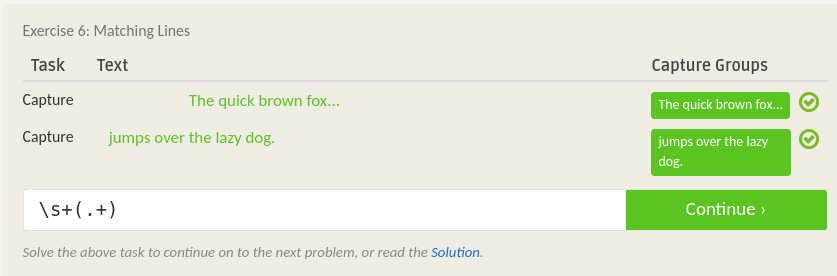

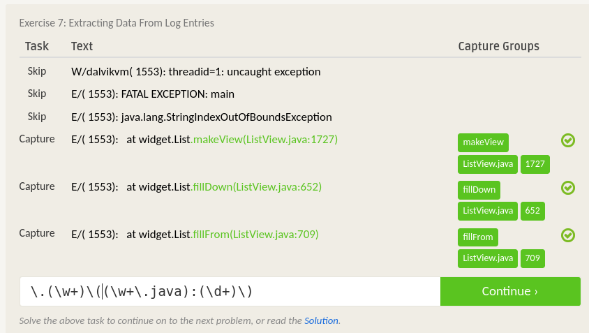

**Crossword:**

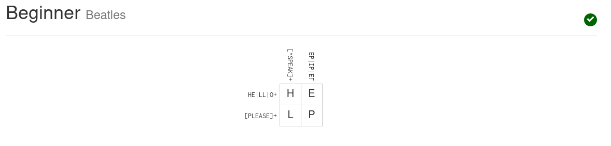

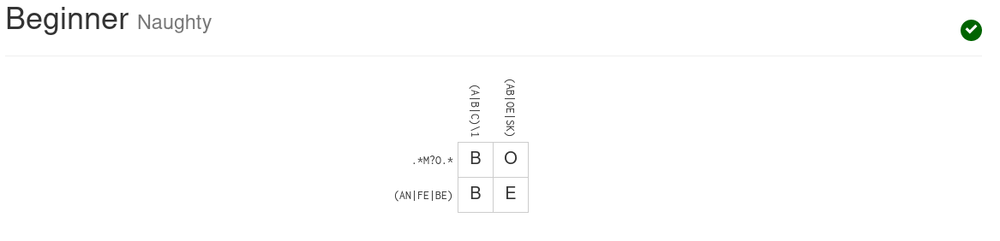

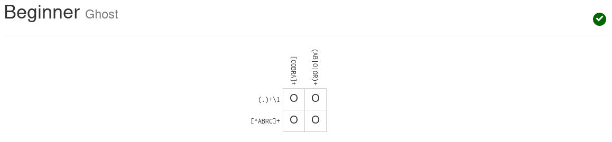

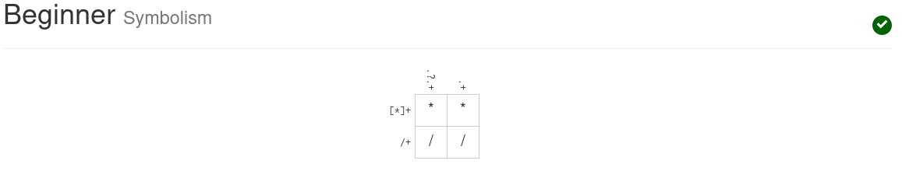

## 5. Play with Snap or Blockly

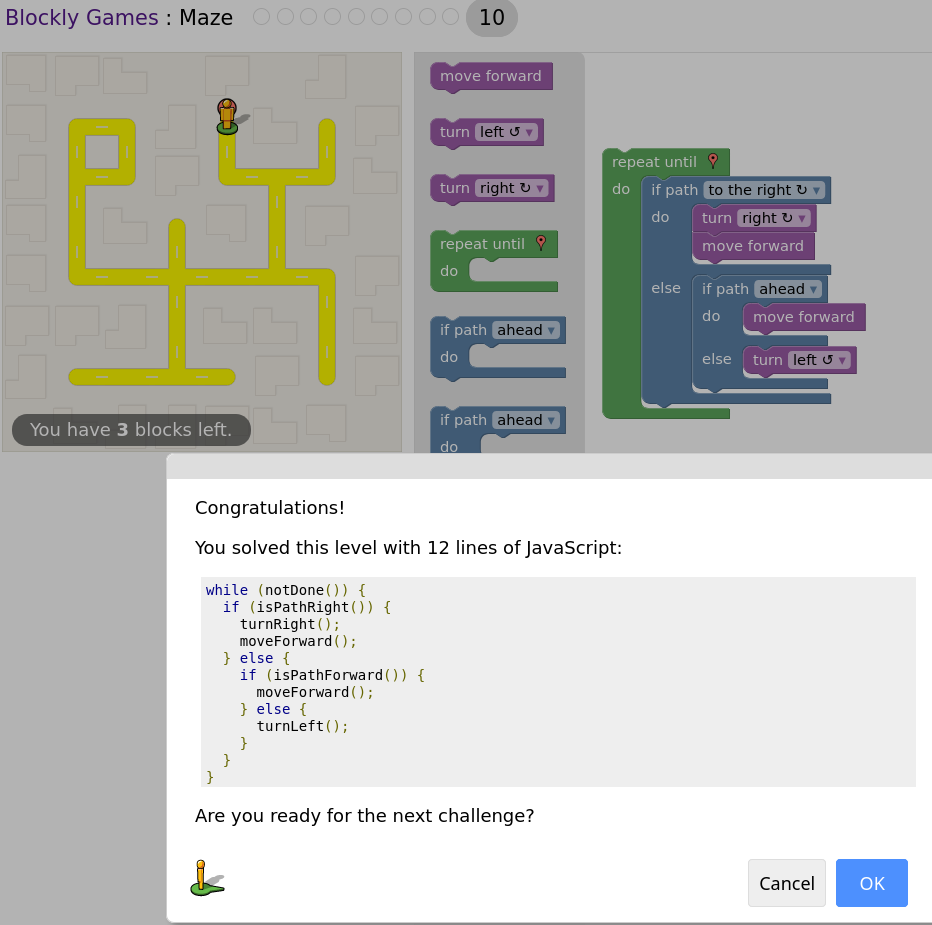

## 6. Reflection
