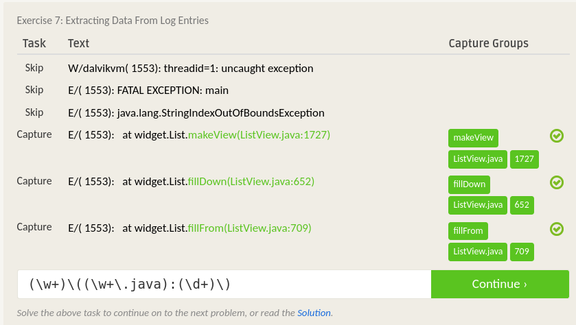

# Lab 01 Report - Introduction to Open Source Software

## 0. Join the Discord if you haven't already

Discord message:

## 1. Create and setup a Github account

[Github handle](https://github.com/Prasantacharya)

### Bio

I am a computer science student at RPI.

Discord handle: Shape Shifter#1175
  * On the server, I am Prasant

### Lab Reports
[Lab 1](labs/lab-01/lab01.md)

## 2. Reading assignments

* Open Source Definition

  1. The Open Source Definition are very important criteria, because they ensure that code is not only accessible to view, but easy for people to use, modify and add onto without much if any hinderance on those who tinker with the source. It ensures that not only is the code visible, but that it is possible to build on and improve and evolved into different forms.

* Smart Questions

  2. Two suggestions I had for `How To Answer Questions in a Helpful Way`  

    a. If they are doing something that has multiple steps, it might be helpful to warn them of some things they may see in the future, or where to look in the documentation when it does show up, so they don't have to come asking a few minutes later. For example, if they are trying to compile some code that needs to be done in several steps, and they are stuck on the first few, you could also warn them to be sure that some tool they will use later in the compilation is the latest version.

    b. If there are multiple different solutions to the problem they face and the problem is documented, give them one possible answer before pointing them into the documentation. This is a bit nicer than just sending them to the documentation right away, espically if the documentation is a bit arcane (as they tend to be).

* Free Culture

  3. There were a few main things I got out of the reading of chapter 3 of Free Culture. The first thing that stuck me was how the RIAA was able to get away with asking for absurd reparations for what had occurred. They asked for billions for something that would in no way be worth that amount when aggregated. The greed of the RIAA was also put on display when they asked for everything that Jesse had in exchange for dropping a suit. Not only that, but the fact that the plaintiffs would not receive any compensation for their trouble exemplifies the inherent imbalance in that situation. The RIAA would not lose anything for filing a false claim, yet the plaintiff would quite literally lose all the money they had. The fact that the RIAA faces no repercussions for doing something like this feels deeply wrong on a moral level. The final thing I got from the reading was how the RIAA was insistent on stopping the chain of progress that had been built up till that point. They wanted an injunction that would prevent him from working on technology, something that he had already shown that he was capable of improving. Not only that but the RIAA went after students that made minimal changes to already existing technology. They sought to stop progress on something that had been shown to be improving and starting to evolve, because it could possibly affect them financially. 

## 3. Linux

## 4. Regex

**Regex problems:**

**Crossword:**

## 5. Play with Snap or Blockly

## 6. Reflection

I would like to evaluate the [Transmission bit-torrent client](https://github.com/transmission/transmission). The project interests me because the bit-torrent protocol interests me, and I wonder how they deal with and optimize the network traffic inherent in the protocol. It is also able to be run on Mac, Windows, and linux/BSD with no real difference between the interfaces and network preformance (as far as I can tell). I would find out how they optimize their code for all three platforms.
