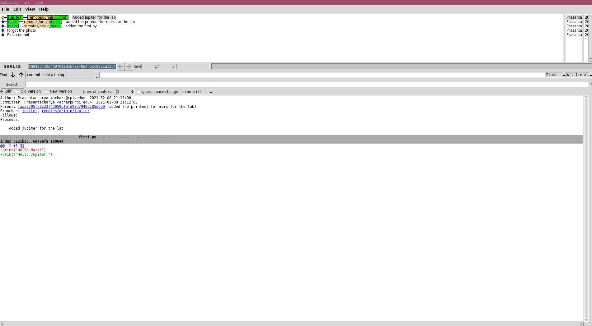
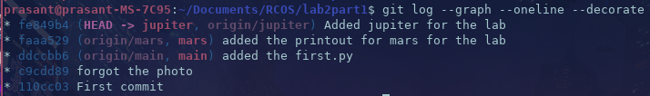
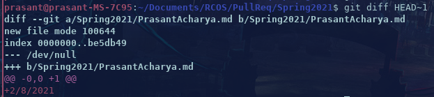

# lab 2 file:

## Part 1
[Link to the repo](https://github.com/Prasantacharya/lab2part1)

**Photos:**

## Part 2

[Forked repo](https://github.com/Prasantacharya/Spoon-Knife)

## Part 3

[Pull repuest](https://github.com/Prasantacharya/PullReq)

