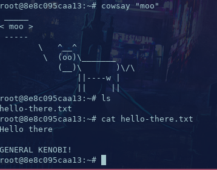
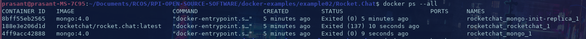

# Example 0


# Example 1



# Example 2




# Example 3


# Example 4

```Dockerfile
# Use node 10.15.3 LTS
FROM node:10.15.3
ENV LAST_UPDATED 20190325T175400

# Copy source code
COPY . /app

# Change working directory
WORKDIR /app

# Install dependencies
RUN npm install

# Fix up some of the issues
RUN npm audit fix

# Expose API port to the outside
EXPOSE 1337

# Launch application
CMD ["node","app.js"]

```

```yml
version: '3'

services:
  mongo:
    image: mongo:4.0.7
    volumes:
      - mongo-data:/data/db
    expose:
      - "27017"
  app:
    build: .
    ports:
            - "1337:1337"
    links:
      - mongo
    depends_on:
      - mongo
    environment:
      - MONGO_URL=mongodb://mongo/messageApp

volumes:
  mongo-data:

```


