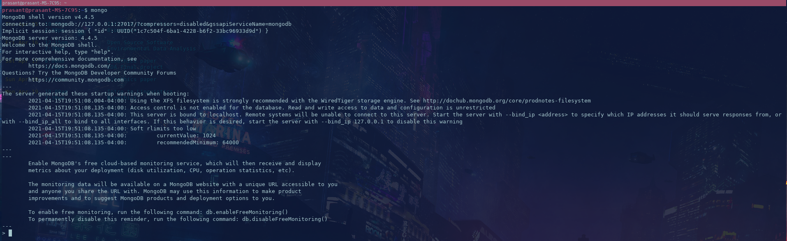
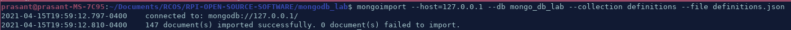
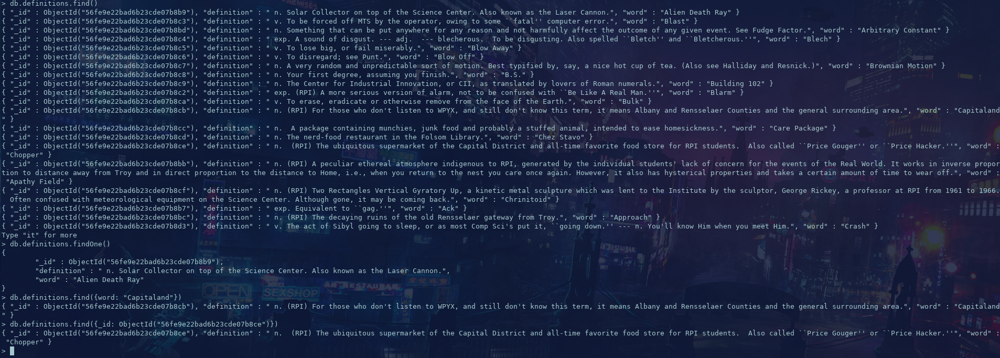

# Checkpoint 0

[check dev-log here](https://github.com/weeb-poly/miso/wiki/Weekly_Log)

# Checkpoint 1

# Checkpoint 2

# Checkpoint 3

# Checkpoint 4

[link to code](checkpoint4.py)

[link to output](output.txt)

# Checkpoint 5

[link to code](checkpoint5.py)

