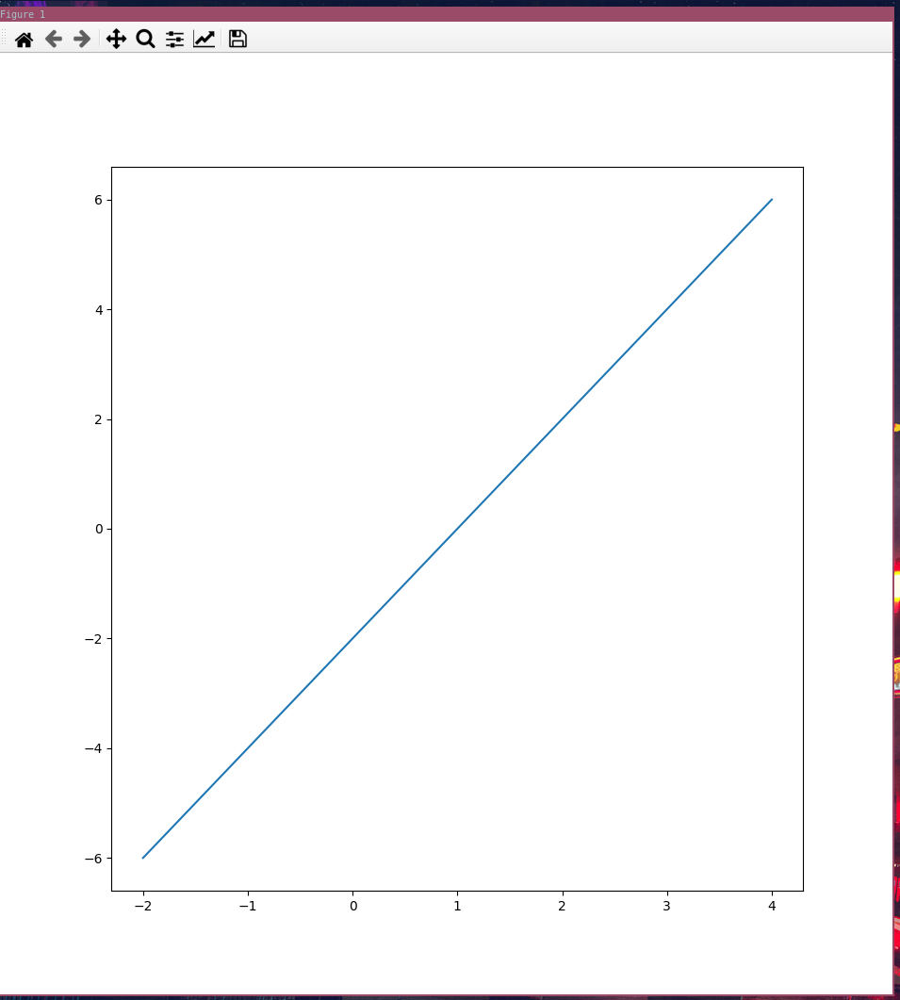
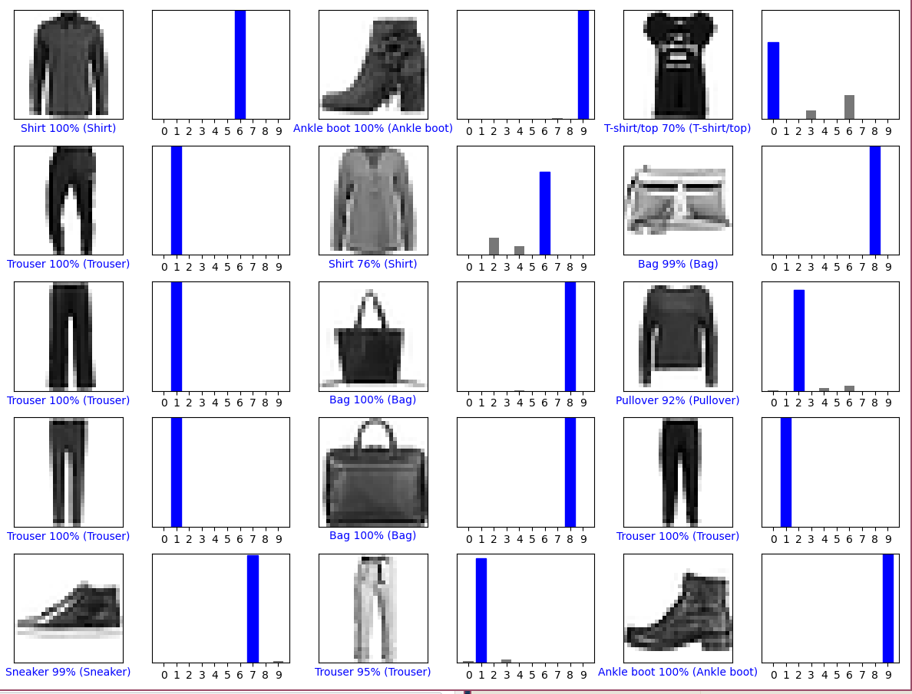
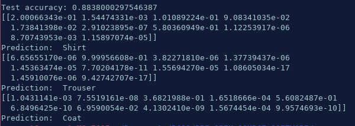
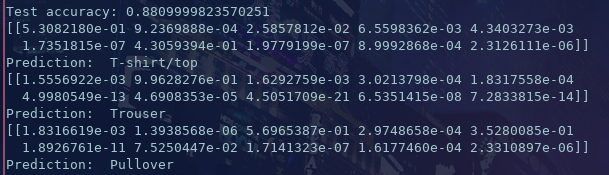

# Lab 10: Tensor flow

## Part 1

## Part 2

* The changes made were adding `9000 + ` to `i` and `predictions[]` as an offset, along with including `plt.tight_layout()` since that was missing before.

## Part 3

2/3 correct overall.

Interestingly enough, when run a second time, it got it correct.

